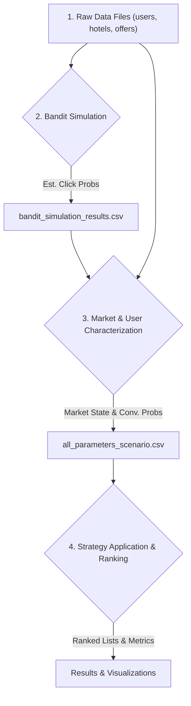

# trivago Offer Ranking Simulator

## Project Overview & Business Context

trivago, as a leading hotel metasearch engine, faces a unique challenge: it does not set hotel prices, but must rank competing offers for the same hotel from multiple partners (e.g., Booking.com, Expedia, HotelDirect). The core business problem is to design a ranking system that:
- **Maximizes trivago's commission revenue** (by promoting higher-commission offers)
- **Maintains high user conversion** (by showing relevant, attractive offers)
- **Preserves long-term user trust** (by avoiding manipulative or inconsistent rankings)

This project simulates and optimizes this multi-objective ranking problem, providing a realistic, data-driven environment for strategy development and experimentation.

### trivago's Business Model

trivago operates as a **metasearch platform** that aggregates hotel offers from multiple booking partners. When users search for hotels, trivago displays a ranked list of offers from different partners (Booking.com, Expedia, Hotels.com, etc.) for the same hotel. trivago earns revenue through:

1. **Cost-per-click (CPC) commissions** from partners when users click on offers
2. **Revenue sharing** when users complete bookings through partner links
3. **Display advertising** from hotel chains and partners

The ranking algorithm must balance:
- **Revenue optimization**: Promoting offers with higher commission rates
- **User experience**: Showing relevant, competitively-priced offers
- **Trust maintenance**: Avoiding manipulative rankings that erode user confidence

## Methodology & Workflow

The simulator implements a sophisticated four-stage pipeline that mirrors real-world hotel ranking systems:



### Stage 1: Raw Data Generation
- **User Profiles**: Demographics, preferences, price sensitivity, loyalty status
- **Hotel Data**: Properties, amenities, ratings, locations
- **Partner Offers**: Pricing, commission rates, availability, special features

### Stage 2: Bandit Simulation
- Simulates user click behavior across different ranking positions
- Estimates click-through rates (CTR) for each offer-position combination
- Accounts for position bias (higher positions get more clicks)
- Generates `bandit_simulation_results.csv` with probability estimates

### Stage 3: Market & User Characterization
- **Market Demand Index**: Combines price trends, competition density, booking urgency
- **Dynamic Price Sensitivity**: User-specific sensitivity based on market conditions
- **Conversion Probabilities**: Likelihood of booking after clicking an offer
- Outputs comprehensive scenario data for optimization

### Stage 4: Strategy Application & Ranking
- **Greedy Strategy**: Maximize commission revenue
- **User-First Strategy**: Prioritize user satisfaction and low prices
- **Stochastic LP**: Multi-objective optimization using linear programming
- **RL Policy**: Adaptive strategy based on market conditions

## Features & Modeling Approach

### Market Demand Characterization
- **Market Demand Index (MDI):** We construct a composite index for each destination using proxies such as price trends (from 24h price history), competition density (unique hotels × partners), and booking urgency (days to go). This index dynamically segments the market into low, medium, or high demand states.

### Dynamic Price Sensitivity
- **User-Specific Modeling:** Each user's price sensitivity is not static. It is dynamically adjusted based on their days_to_go, the volatility and level of prices in their destination, and their base profile. This allows the system to simulate realistic user behavior under different market conditions.

### Predictive Models (Forecasting)
- **pCTR (Predicted Click-Through Rate):** ML models estimate the probability a user will click an offer, based on price competitiveness, brand, and user context.
- **pCVR (Predicted Conversion Rate):** ML models estimate the probability a click will convert to a booking, incorporating price difference, hotel quality, amenities match, and user/brand factors.
- These predictions serve as key inputs to the optimization layer.

### Optimization Strategies
- **Stochastic Linear Programming (LP):**
  - Maximizes expected revenue subject to business constraints (e.g., minimum trust score, partner diversity).
  - Mathematical Formulation:
    ```math
    \max_{x} \sum_{i,j} x_{ij} (w_{rev} R_{ij} + w_{rel} Q_{ij} + w_{trust} T_{ij})
    ```
    where $x_{ij}$ is the assignment of offer $j$ to rank $i$, and $R_{ij}$, $Q_{ij}$, $T_{ij}$ are revenue, relevance, and trust scores.
- **Reinforcement Learning (DQN):**
  - Acts as a strategic layer, learning the optimal policy for configuring the LP solver's constraints based on observed market state.
  - Enables adaptive, context-aware ranking strategies that evolve over time.
- **Multi-Armed Bandit (MAB):**
  - Used for visualizing and experimenting with the exploration-exploitation trade-off between different ranking strategies.
  - Provides empirical feedback on which strategy performs best under varying market/user conditions.

## Architecture

- **Frontend (R/Shiny):**
  - Serves as the interactive UI layer for scenario setup, strategy selection, and results visualization.
  - Handles user input, displays tables/plots, and provides a seamless analyst experience.
- **Backend (Python/FastAPI):**
  - Contains all business logic, including data simulation, ML predictions, and optimization models (LP, RL, MAB).
  - Exposes a REST API for all operations, making the system modular and scalable.
  - All data generation, scenario saving, and advanced modeling happens here.
- **Communication:**
  - The frontend and backend communicate exclusively via REST API calls, ensuring clear separation of concerns and easy extensibility.

## Installation & Setup

### Prerequisites
- Docker and Docker Compose
- At least 4GB RAM available for Docker
- Python 3.8+ (for data generation)

### Data Generation

Before running the application, you need to generate the base datasets. The application includes a comprehensive data generator that creates realistic hotel, partner offers, and user profile datasets.

#### Generate Base Datasets

Navigate to the `data/` directory and run the data generation script:

```bash
# Maximum dataset (may take several minutes)
python data/generate_enhanced_datasets.py --hotels 10000 --offers 50000 --users 1000
```

#### Command Line Syntax

```bash
python generate_enhanced_datasets.py [OPTIONS]

Options:
  --hotels INT    Number of hotels to generate (default: 10000)
  --offers INT    Number of partner offers to generate (default: 10000)  
  --users INT     Number of user profiles to generate (default: 10000)
  -h, --help      Show help message
```

#### Command Line Options

**Note**: Use `--hotels`, `--offers`, and `--users` (not `--num_hotels`, `--num_offers`, `--num_users`).

| Parameter | Default | Description |
|-----------|---------|-------------|
| `--hotels` | 10000 | Number of hotels to generate |
| `--offers` | 10000 | Number of partner offers to generate |
| `--users` | 10000 | Number of user profiles to generate |

#### Example Commands

```bash
# Quick test with minimal data
python data/generate_enhanced_datasets.py --hotels 50 --offers 200 --users 20

# Small dataset for development
python data/generate_enhanced_datasets.py --hotels 200 --offers 1000 --users 50

# Medium-sized dataset (recommended for testing)
python data/generate_enhanced_datasets.py --hotels 500 --offers 2000 --users 100

# Large dataset for production simulation
python data/generate_enhanced_datasets.py --hotels 2000 --offers 40000 --users 100

# Maximum dataset (may take several minutes)
python data/generate_enhanced_datasets.py --hotels 10000 --offers 50000 --users 1000
```

#### Generated Files

The script creates three main CSV files in the `data/` directory:
- `enhanced_hotels.csv`: Hotel properties with amenities, ratings, and location data
- `enhanced_partner_offers.csv`: Partner offers with pricing, availability, and commission data  
- `enhanced_user_profiles.csv`: User profiles with preferences, budgets, and travel patterns

#### Expected Output

When successful, you should see output like:
```
🏨 Starting Enhanced Hotel Dataset Generation...
📊 Generating Hotels dataset (2000 rows)...
✅ Hotels dataset saved: 2000 rows, 15 columns
💰 Generating Partner Offers dataset (40000 rows)...
✅ Partner Offers dataset saved: 40000 rows, 19 columns
👥 Generating User Profiles dataset (100 rows)...
✅ User Profiles dataset saved: 100 rows, 17 columns

📈 Dataset Summary:
Hotels: 2000 rows across 20 cities
Partner Offers: 40000 rows from 15 partners
User Profiles: 100 rows with 5 user types

🎉 All datasets generated successfully!
Files created:
- enhanced_hotels.csv
- enhanced_partner_offers.csv
- enhanced_user_profiles.csv
```

### Quick Start
```bash
# Clone the repository
git clone <repository-url>
cd Dynamic-Pricing-app

# Generate base datasets (recommended for testing)
python data/generate_enhanced_datasets.py --hotels 500 --offers 2000 --users 100

# Start the application
docker-compose up --build

# Access the application
# Frontend: http://localhost:3838
# Backend API: http://localhost:8001
```

### Data Files
The application uses the following CSV files in the `data/` directory:
- `enhanced_user_profiles.csv`: User demographics and preferences
- `enhanced_hotels.csv`: Hotel properties and amenities
- `enhanced_partner_offers.csv`: Partner offer details and pricing
- `bandit_simulation_results.csv`: Click probability estimates
- `conversion_probabilities.csv`: Booking conversion rates
- `market_state_by_location.csv`: Market demand indicators

## Usage Guide

### Tab 1: Scenario & Model Inputs
1. **Select User ID**: Choose from the dropdown populated with available users
2. **Load User Scenario**: Click to load comprehensive data for the selected user
3. **Review Raw Data**: Examine the "raw materials" that feed into the ranking models

### Tab 2: Strategy Comparison
1. **Choose Strategy**: Select from Greedy, User-First, Stochastic LP, RL Policy, or "all"
2. **Apply Strategy**: Execute the ranking algorithm
3. **Compare Results**: View side-by-side comparisons of different strategies

### Tab 3: Dashboard & trivago Insights
1. **Pareto Frontier**: Visualize the trade-off between revenue and user trust
2. **Market Analysis**: Understand demand distribution and price sensitivity
3. **Performance Metrics**: Compare strategy effectiveness across key metrics

## Core Mathematical Formulas

### 1. Composite Market Demand Index
A weighted index to characterize market demand by combining normalized proxies for price, booking urgency, volatility, and competition:

```math
\text{MarketDemandIndex} = w_1 \cdot \text{normAvgPrice} + w_2 \cdot (1 - \text{normDaysToGo}) + w_3 \cdot \text{normPriceVariance} + w_4 \cdot \text{normCompetitionDensity}
```
Where:
- $\text{normAvgPrice}$: Normalized average price for the location
- $\text{normDaysToGo}$: Normalized average days to go
- $\text{normPriceVariance}$: Normalized price variance for the location
- $\text{normCompetitionDensity}$: Normalized competition density (unique hotels × unique partners)
- $w_1, w_2, w_3, w_4$: Weights (default 0.25 each, configurable)

### 2. Dynamic Price Sensitivity
Each user's dynamic price sensitivity is modeled as:

```math
\text{dynamic\_sensitivity} = 0.5 \cdot S_{\text{base}} + 0.2 \cdot \left(1 - \frac{\min(D, 180)}{180}\right) + 0.3 \cdot \left(\frac{\sigma_p}{\mu_p + 1}\right)
```

Where:
- $S_{\text{base}}$: User's basic price sensitivity (from profile)
- $D$: Days to go for check-in (from offers)
- $\mu_p$, $\sigma_p$: Mean and std of all offered prices in the destination

### 3. Multi-Objective Utility Function
Defines the total expected utility $U(i, j)$ of placing offer $j$ at rank $i$:

```math
U(i, j) = w_{\text{rev}} \cdot R_{ij} + w_{\text{rel}} \cdot Q_{ij} + w_{\text{trust}} \cdot T_{ij}
```

Where:
- $R_{ij}$: Revenue for offer $j$ at position $i$
- $Q_{ij}$: Relevance (quality) score
- $T_{ij}$: Trust score
- $w_{\text{rev}}, w_{\text{rel}}, w_{\text{trust}}$: Tunable weights

### 4. Price Competitiveness CTR Model
Predicts click-through rate (CTR) as a function of price competitiveness:

```math
\text{CTR}_{ij} = \text{base\_CTR}_j \cdot e^{-\beta (\text{price}_j - \text{min\_price})}
```

Where $\beta$ is a user or market price sensitivity parameter.

### 5. Price Volatility Penalty on Trust
Penalizes trust for offers with unstable prices:

```math
T_{ij} = \text{base\_trust}_j - \gamma \cdot \sigma^2(\text{price}_j, t-24h)
```

Where $\gamma$ is a volatility penalty weight and $\sigma^2$ is the variance of price over the last 24h.

### 6. Linear Programming Optimization Model

#### Objective Function
The main optimization objective maximizes expected revenue while considering multiple factors:

```math
\max_{x_{ij}} \sum_{i=1}^{n_{\text{offers}}} \sum_{j=1}^{n_{\text{positions}}} x_{ij} \cdot \left(w_{\text{conv}} \cdot C_i + w_{\text{rev}} \cdot R_i + w_{\text{trust}} \cdot T_i\right) \cdot \frac{1}{\log_2(j + 2)}
```

Where:
- $x_{ij}$: Binary decision variable (1 if offer $i$ is placed at position $j$)
- $C_i$: Conversion likelihood score for offer $i$
- $R_i$: Revenue score for offer $i$
- $T_i$: Trust score for offer $i$
- $w_{\text{conv}}, w_{\text{rev}}, w_{\text{trust}}$: Objective weights
- $\frac{1}{\log_2(j + 2)}$: Position weight (higher positions get more weight)

#### Constraints

**Position Uniqueness:**
```math
\sum_{i=1}^{n_{\text{offers}}} x_{ij} \leq 1 \quad \forall j \in \{1, \ldots, n_{\text{positions}}\}
```

**Offer Uniqueness:**
```math
\sum_{j=1}^{n_{\text{positions}}} x_{ij} \leq 1 \quad \forall i \in \{1, \ldots, n_{\text{offers}}\}
```

**Price Competitiveness:**
```math
x_{ij} = 0 \quad \forall i, j \text{ where } \text{price}_i > 1.5 \cdot \min_{k} \text{price}_k \text{ and } j \leq 3
```

**Partner Diversity:**
```math
\sum_{i \in \text{Partner}_p} \sum_{j=1}^{5} x_{ij} \leq 2 \quad \forall \text{partner } p
```

### 7. Conversion Probability Model

The conversion probability for an offer is calculated as a product of interpretable factors:

```math
P(\text{conversion}) = S_{\text{price}} \times S_{\text{rating}} \times S_{\text{amenities}} \times S_{\text{loyalty}} \times S_{\text{brand}}
```

Where each factor is defined as:

**Price Factor:**
```math
S_{\text{price}} = \max\left(0.1, 1 - \frac{|\text{trivago\_price} - \text{partner\_price}|}{\text{user\_budget\_max} + 1}\right)
```

**Rating Factor:**
```math
S_{\text{rating}} = 0.5 + 0.1 \times (\text{hotel\_rating} - 3)
```

**Amenities Factor:**
```math
S_{\text{amenities}} = 0.5 + 0.1 \times \min(\text{amenities\_match}, 5)
```

**Loyalty Factor:**
```math
S_{\text{loyalty}} = \begin{cases} 
1.0 & \text{if user is Gold/Platinum} \\ 
0.8 & \text{if Silver} \\ 
0.6 & \text{otherwise} 
\end{cases}
```

**Brand Factor:**
```math
S_{\text{brand}} = \begin{cases} 
1.0 & \text{if partner is Booking.com/Expedia} \\ 
0.9 & \text{otherwise} 
\end{cases}
```

### 8. Click Probability Model

#### True Click Probability
The theoretical probability that a user would click on an offer at a given rank:

```math
\text{true\_click\_prob} = \min(0.95, \max(0.05, \text{preference\_score} \times \text{rank\_factor}))
```

Where:
```math
\text{rank\_factor} = \frac{1}{\text{rank}}
```

#### Normalized Click Probability
For relative comparison among offers at the same rank:

```math
\text{normalized\_probability\_of\_click}_i = \frac{\exp(\text{probability\_of\_click}_i)}{\sum_j \exp(\text{probability\_of\_click}_j)}
```

### 9. Trust Score Calculation

The user trust score combines multiple factors:

```math
\text{trust\_score} = 0.4 \times \text{price\_score} + 0.3 \times \text{consistency\_score} + 0.3 \times \text{brand\_trust}
```

Where:

**Price Score:**
```math
\text{price\_score} = 100 \times \left(1 - \frac{\text{offer\_price} - \min(\text{prices})}{\max(\text{prices}) - \min(\text{prices})}\right)
```

**Consistency Score:**
```math
\text{consistency\_score} = 100 \times \left(1 - \frac{|\text{trivago\_price} - \text{partner\_price}|}{\text{partner\_price}}\right)
```

### 10. Expected Revenue Calculation

The expected revenue for each offer-position combination:

```math
\text{expected\_revenue}_{ij} = \text{bid\_amount}_i \times \text{conversion\_probability}_i \times \text{user\_preference}_{ij} \times \frac{1}{j + 1}
```

Where $\frac{1}{j + 1}$ represents the rank decay factor.

## API Endpoints

### Core Endpoints
- `POST /get_scenario_inputs`: Get list of available user IDs
- `POST /get_user_scenario`: Load comprehensive scenario data for a user
- `POST /rank`: Apply ranking strategies and return results

### Data Endpoints
- `GET /user_profiles`: Get sample user profiles
- `GET /user_profile/{user_id}`: Get specific user profile
- `GET /market_analysis/{destination}`: Get market analysis for destination

### Optimization Endpoints
- `POST /run_deterministic_optimization`: Run PuLP optimization
- `POST /run_stochastic_optimization`: Run MiniZinc optimization
- `GET /optimization_results`: Get latest optimization results

## Performance Metrics

The system tracks several key performance indicators:

1. **Expected Revenue**: Total expected commission revenue from ranked offers
2. **User Trust Score**: Composite score reflecting user confidence in rankings
3. **Conversion Rate**: Percentage of clicks that convert to bookings
4. **Click-Through Rate**: Percentage of impressions that result in clicks
5. **Price Consistency**: Measure of price transparency and accuracy
6. **Partner Satisfaction**: Balance of partner representation in rankings

## Business Insights

### Revenue vs. Trust Trade-off
The Pareto frontier visualization reveals the fundamental tension between maximizing revenue and maintaining user trust. Optimal strategies balance these competing objectives based on market conditions.

### Market Condition Adaptation
The RL Policy strategy demonstrates how ranking algorithms can adapt to different market states:
- **High Demand**: Prioritize revenue maximization
- **Medium Demand**: Balanced approach
- **Low Demand**: Focus on user satisfaction

### Position Bias Impact
The click probability analysis shows the dramatic effect of ranking position on user engagement, with top positions receiving significantly more clicks than lower positions.

## Future Enhancements

1. **Real-time Learning**: Implement online learning algorithms that adapt to user behavior
2. **A/B Testing Framework**: Add capability to test different ranking strategies
3. **Personalization**: Develop user-specific ranking models
4. **Multi-objective Optimization**: Advanced optimization techniques for complex constraints
5. **Predictive Analytics**: Enhanced forecasting models for market trends

## Contributing

This project serves as a demonstration of sophisticated hotel ranking optimization. For contributions or questions, please refer to the project documentation and code comments.

## License

This project is developed for educational and demonstration purposes related to hotel metasearch optimization.

---

*This simulator demonstrates the complexity and sophistication required for real-world hotel ranking systems, showcasing advanced optimization techniques, user behavior modeling, and business intelligence capabilities.*
