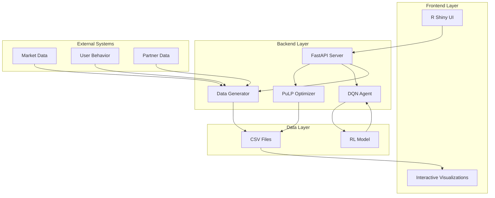
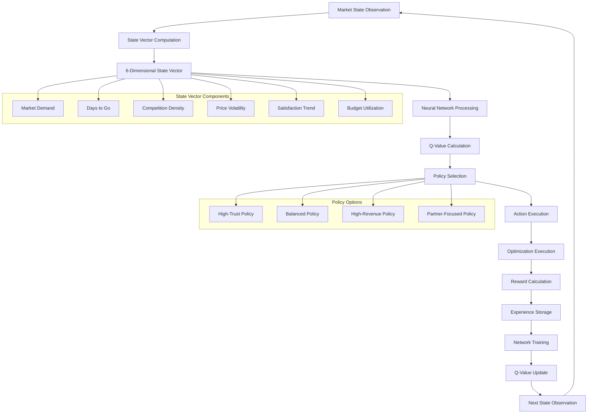

# Dynamic Pricing Application

A sophisticated multi-objective optimization system for hotel ranking and pricing strategies, built with FastAPI backend and R Shiny frontend.

## 🚀 Features

- **Multi-Objective Optimization**: Balance Trivago revenue, user satisfaction, and partner value
- **Reinforcement Learning**: Pre-trained DQN agent for optimal policy selection
- **Bandit Simulation**: Comprehensive click-through rate analysis
- **Strategic Simulation**: End-to-end testing of optimization strategies
- **Data Generation**: Realistic hotel and user data generation
- **Ecosystem Health Monitoring**: Budget utilization and market balance analysis

## 🏗️ Architecture

- **Backend**: FastAPI (Python) with PuLP optimization
- **Frontend**: R Shiny with interactive visualizations
- **Containerization**: Docker Compose for easy deployment
- **Data Storage**: CSV files for persistence and analysis

### System Architecture Diagram


```mermaid
graph TB
    subgraph "Frontend Layer"
        UI[R Shiny UI]
        Viz[Interactive Visualizations]
    end
    
    subgraph "Backend Layer"
        API[FastAPI Server]
        Opt[PuLP Optimizer]
        RL[DQN Agent]
        Data[Data Generator]
    end
    
    subgraph "Data Layer"
        CSV[CSV Files]
        Model[RL Model]
    end
    
    subgraph "External Systems"
        Market[Market Data]
        Users[User Behavior]
        Partners[Partner Data]
    end
    
    UI --> API
    API --> Opt
    API --> RL
    API --> Data
    Opt --> CSV
    RL --> Model
    Data --> CSV
    Market --> Data
    Users --> Data
    Partners --> Data
    CSV --> Viz
    Model --> RL
```

## 🧠 Reinforcement Learning Policies

The system uses a pre-trained Deep Q-Network (DQN) agent with four distinct policies:

### Policy Definitions

| Policy Name | α (Trivago) | β (User) | γ (Partner) | Strategy Focus |
|-------------|-------------|----------|-------------|----------------|
| **High-Trust Policy** | 0.2 | 0.6 | 0.2 | User satisfaction prioritized |
| **Balanced Policy** | 0.4 | 0.3 | 0.3 | Equal balance of objectives |
| **High-Revenue Policy** | 0.6 | 0.2 | 0.2 | Trivago revenue maximization |
| **Partner-Focused Policy** | 0.3 | 0.2 | 0.5 | Partner value maximization |

## 🧠 Deep Q-Network (DQN) Architecture

### State Space (6-Dimensional Market State Vector)

The DQN observes a **6-dimensional state vector** representing current market conditions. Each dimension is normalized to the [0,1] range for optimal neural network performance.

#### State Dimension Definitions

| Dimension | Raw Computation | Normalization | Business Interpretation |
|-----------|----------------|---------------|------------------------|
| **Market Demand** | Total number of offers/users | min(demand/100, 1.0) | Market activity level |
| **Days to Go** | Average booking lead time | min(days/365, 1.0) | Booking urgency |
| **Competition Density** | Number of unique partners | min(competitors/20, 1.0) | Market competitiveness |
| **Price Volatility** | Coefficient of variation | min(volatility/0.5, 1.0) | Price stability |
| **Satisfaction Trend** | Historical satisfaction data | (trend + 1) / 2 | User satisfaction direction |
| **Budget Utilization** | Budget consumption percentage | min(utilization/100, 1.0) | Partner budget status |

#### State Dimension Business Meanings

**Market Demand (0-1)**
- **High (0.8-1.0)**: Strong market activity, many users searching
- **Medium (0.4-0.7)**: Moderate market activity  
- **Low (0.0-0.3)**: Weak market activity, few users

**Days to Go (0-1)**
- **Low (0.0-0.2)**: Immediate bookings (0-73 days)
- **Medium (0.2-0.5)**: Short-term bookings (73-183 days)
- **High (0.5-1.0)**: Long-term bookings (183+ days)

**Competition Density (0-1)**
- **Low (0.0-0.3)**: Monopoly/oligopoly (1-6 partners)
- **Medium (0.3-0.7)**: Competitive market (6-14 partners)
- **High (0.7-1.0)**: Highly competitive (14+ partners)

**Price Volatility (0-1)**
- **Low (0.0-0.3)**: Stable pricing, predictable market
- **Medium (0.3-0.7)**: Moderate price fluctuations
- **High (0.7-1.0)**: High price volatility, dynamic market

**Satisfaction Trend (0-1)**
- **Low (0.0-0.3)**: Declining user satisfaction
- **Medium (0.3-0.7)**: Stable satisfaction
- **High (0.7-1.0)**: Improving user satisfaction

**Budget Utilization (0-1)**
- **Low (0.0-0.3)**: Under-utilized budgets (0-30%)
- **Medium (0.3-0.7)**: Balanced budget usage (30-70%)
- **High (0.7-1.0)**: High budget utilization (70-100%)

### Action Space (4 Policy Options)

The DQN can choose from **4 predefined policies**:

| Action | Policy Name | α (Revenue) | β (User) | γ (Partner) | Use Case |
|--------|-------------|-------------|----------|-------------|----------|
| **0** | High-Trust Policy | 0.2 | 0.6 | 0.2 | User satisfaction focus |
| **1** | Balanced Policy | 0.4 | 0.3 | 0.3 | Balanced approach |
| **2** | High-Revenue Policy | 0.6 | 0.2 | 0.2 | Revenue maximization |
| **3** | Partner-Focused Policy | 0.3 | 0.2 | 0.5 | Partner value focus |

### Reward Function (Multi-Objective)

The reward is calculated based on **optimization results** using a multi-objective approach that balances all three business objectives.

#### Reward Calculation Formula

$$R = 0.4 \times \frac{\text{Trivago Income}}{1000} + 0.3 \times \frac{\text{User Satisfaction}}{10} + 0.3 \times \frac{\text{Partner Conversion Value}}{10}$$

Where:
- **Trivago Income**: Revenue generated for Trivago (normalized by 1000)
- **User Satisfaction**: User satisfaction score (normalized by 10)
- **Partner Conversion Value**: Value generated for partners (normalized by 10)

#### Reward Classification

| Reward Range | Performance Level | Business Interpretation |
|--------------|------------------|------------------------|
| **0.8 - 1.0** | Excellent | High revenue + good user satisfaction + good partner value |
| **0.6 - 0.8** | Good | Balanced performance across all objectives |
| **0.4 - 0.6** | Fair | Moderate performance with some trade-offs |
| **0.2 - 0.4** | Poor | Low performance across objectives |
| **0.0 - 0.2** | Very Poor | Significant performance issues |

### Learning Process

#### Action Selection (Epsilon-Greedy Strategy)

The DQN uses an epsilon-greedy strategy to balance exploration and exploitation:

**Exploration Phase** (ε = 1.0 → 0.01): 
- Random policy selection to discover new strategies
- Gradually reduces exploration rate as learning progresses

**Exploitation Phase** (ε ≈ 0.01): 
- Uses learned Q-values to select optimal policies
- Maximizes expected reward based on experience

#### Neural Network Architecture

The DQN uses a feedforward neural network with the following structure:

| Layer | Input Size | Output Size | Activation | Purpose |
|-------|------------|-------------|------------|---------|
| **Input Layer** | 6 | 64 | ReLU | State vector processing |
| **Hidden Layer 1** | 64 | 64 | ReLU | Feature extraction |
| **Hidden Layer 2** | 64 | 4 | Linear | Q-value output |

#### Q-Learning Update Rule

The Q-learning algorithm updates Q-values using the Bellman equation:

$$Q(s_t, a_t) \leftarrow Q(s_t, a_t) + \alpha \left[ r_t + \gamma \max_{a'} Q(s_{t+1}, a') - Q(s_t, a_t) \right]$$

Where:
- $$s_t$$: Current state
- $$a_t$$: Selected action
- $$r_t$$: Received reward
- $$s_{t+1}$$: Next state
- $$\alpha$$: Learning rate
- $$\gamma$$: Discount factor (0.95)

### Policy Selection Logic

The DQN learns **market-condition → optimal-policy** mappings through experience. The agent discovers patterns that maximize long-term rewards across different market scenarios.

#### Learned Policy Selection Patterns

| Market Condition | Optimal Policy | Rationale |
|------------------|----------------|-----------|
| **High Demand + Low Competition** | High-Revenue Policy | Revenue opportunities are maximized |
| **High Competition + Low Satisfaction** | High-Trust Policy | User satisfaction becomes critical |
| **High Budget Utilization** | Partner-Focused Policy | Partner relationships are priority |
| **Balanced Market Conditions** | Balanced Policy | Default approach for stability |

#### State Vector Examples

**Example 1: High-Demand, Low-Competition Market**
- **State Vector**: [0.8, 0.1, 0.2, 0.3, 0.6, 0.4]
- **Market Interpretation**: 
  - High demand (80 offers)
  - Immediate bookings (37 days average)
  - Low competition (4 partners)
  - Low price volatility
  - Improving satisfaction
  - Medium budget utilization
- **Expected Policy**: High-Revenue Policy

**Example 2: Low-Demand, High-Competition Market**
- **State Vector**: [0.3, 0.8, 0.9, 0.7, 0.4, 0.8]
- **Market Interpretation**:
  - Low demand (30 offers)
  - Long-term bookings (292 days average)
  - High competition (18 partners)
  - High price volatility
  - Declining satisfaction
  - High budget utilization
- **Expected Policy**: High-Trust Policy

### Training Convergence

#### Epsilon Decay Schedule

| Training Phase | Epsilon Value | Exploration Rate | Exploitation Rate | Purpose |
|----------------|---------------|------------------|-------------------|---------|
| **Early Training** | 1.0 → 0.8 | 100% → 80% | 0% → 20% | Discover new strategies |
| **Mid Training** | 0.8 → 0.3 | 80% → 30% | 20% → 70% | Balance exploration/exploitation |
| **Late Training** | 0.3 → 0.01 | 30% → 1% | 70% → 99% | Optimize learned strategies |

#### Training Stability Mechanisms

**Target Network Updates**: Every 100 steps
- Prevents overestimation of Q-values
- Stabilizes training convergence
- Improves learning stability

**Experience Replay**: Batch size of 32
- Breaks temporal correlations
- Improves sample efficiency
- Enables stable learning

### Key Insights

1. **Adaptive Learning**: DQN adapts to changing market conditions
2. **Multi-Objective Optimization**: Balances revenue, user satisfaction, and partner value
3. **Experience Replay**: Learns from past experiences to improve future decisions
4. **Exploration vs Exploitation**: Balances trying new strategies vs using proven ones
5. **Market-Aware Policies**: Selects policies based on current market state

The DQN essentially learns **"Which policy works best in which market condition?"** through trial and error, optimizing for long-term performance across all business objectives!

### DQN Learning Process Flow


```mermaid
flowchart TD
    A[Market State Observation] --> B[State Vector Computation]
    B --> C[6-Dimensional State Vector]
    C --> D[Neural Network Processing]
    D --> E[Q-Value Calculation]
    E --> F[Policy Selection]
    F --> G[Action Execution]
    G --> H[Optimization Execution]
    H --> I[Reward Calculation]
    I --> J[Experience Storage]
    J --> K[Network Training]
    K --> L[Q-Value Update]
    L --> M[Next State Observation]
    M --> A
    
    subgraph "State Vector Components"
        S1[Market Demand]
        S2[Days to Go]
        S3[Competition Density]
        S4[Price Volatility]
        S5[Satisfaction Trend]
        S6[Budget Utilization]
    end
    
    subgraph "Policy Options"
        P1[High-Trust Policy]
        P2[Balanced Policy]
        P3[High-Revenue Policy]
        P4[Partner-Focused Policy]
    end
    
    C --> S1
    C --> S2
    C --> S3
    C --> S4
    C --> S5
    C --> S6
    F --> P1
    F --> P2
    F --> P3
    F --> P4
```

### Policy Selection Criteria

The RL agent analyzes market conditions to select optimal policies:

**Market State Variables:**
- **Market Demand**: Number of available offers (normalized 0-1)
- **Days to Go**: Average booking lead time (normalized 0-1)
- **Competition Density**: Number of unique partners (normalized 0-1)
- **Price Volatility**: Standard deviation of prices (normalized 0-1)
- **Satisfaction Trend**: User satisfaction trend (-1 to 1, normalized to 0-1)
- **Budget Utilization**: Partner budget consumption percentage (0-1)

**Policy Selection Logic:**
- **High-Trust Policy**: Selected when user satisfaction is critical (high competition, low user satisfaction)
- **Balanced Policy**: Default choice for normal market conditions
- **High-Revenue Policy**: Chosen when revenue opportunities are high (high demand, low competition)
- **Partner-Focused Policy**: Applied when partner relationships are priority (high budget utilization, low partner satisfaction)

### Mathematical Formulation

#### Two-Stage Optimization System

**Stage 1: Optimal Ranking for Click Maximization**

**Primary Objective Function:**

$$\text{Maximize: } \alpha \times \text{Trivago\_Income} + \beta \times \text{User\_Satisfaction} + \gamma \times \text{Partner\_Conversion\_Value}$$

Where:
- **Trivago_Income**: $$\sum_{i,j} (\text{CTR}_i \times pConvert_j \times Commission_j \times Price_j \times X_{ij})$$
- **User_Satisfaction**: $$\frac{\sum_{i,j} (\text{CTR}_i \times Satisfaction_j \times X_{ij})}{\sum_{i,j} (\text{CTR}_i \times X_{ij})}$$ (weighted average, 0-10 scale)
- **Partner_Conversion_Value**: $$\sum_{i,j} (\text{CTR}_i \times pConvert_j \times Price_j \times X_{ij})$$

**Stage 1 Constraints:**

**Assignment Constraints:**
- $$\sum_j X_{ij} \leq 1$$ for each position $i$ (each position at most one offer)
- $$\sum_i X_{ij} \leq 1$$ for each offer $j$ (each offer at most one position)

**Budget Constraints:**
- $$\sum_{i,j} (\text{CTR}_i \times \text{CPC}_j \times X_{ij}) \leq \text{Remaining\_Budget}_P$$ for each partner $P$

**Weight Constraints:**
- $$\alpha + \beta + \gamma = 1$$ (weights sum to unity)
- $$\alpha, \beta, \gamma \geq 0$$ (non-negative weights)

**Stage 2: Offer Hiding for Reconversion & Budget Rationalization**

**Hiding Decision Function:**
- Hide offer $j$ if: $$\text{Reconversion\_Probability}_j < \text{Threshold}$$ (default: 0.3)
- Hide offer $j$ if: $$\text{Budget\_Utilization} > \text{Target}$$ (default: 0.8)

**Budget Utilization Constraint:**
- $$\frac{\sum_{j \in \text{Visible}} (\text{Expected\_Clicks}_j \times \text{CPC}_j)}{\text{Total\_Budget}_P} \leq \text{Target\_Utilization}$$

#### Decision Variables

**Stage 1 Variables:**
- $$X_{ij}$$: Binary variable indicating if offer $j$ is placed at position $i$ for user $u$
- $$\alpha, \beta, \gamma$$: Weight parameters for multi-objective optimization

**Stage 2 Variables:**
- $$H_j$$: Binary variable indicating if offer $j$ is hidden (1 = hidden, 0 = visible)

#### Position-Based Click-Through Rate

$$\text{CTR}(\text{position}) = \frac{1}{1 + 0.3 \times \text{position}}$$

#### Reconversion Probability

$$\text{Reconversion\_Probability}_j = 0.7 \times \text{Conversion\_Probability}_j$$

#### Final Objective Function Values

**Trivago Income**: Total revenue from commissions and conversions
**User Satisfaction**: Weighted average satisfaction score (0-10 scale)
**Partner Conversion Value**: Total value generated for partners
**Total Objective**: $$\alpha \times \text{Trivago\_Income} + \beta \times \text{User\_Satisfaction} + \gamma \times \text{Partner\_Conversion\_Value}$$

## 📊 Data Flow

1. **Data Generation**: Create realistic hotel and user datasets
2. **Strategic Simulation**: Test optimization with current weights
3. **Policy Selection**: RL agent chooses optimal policy based on market conditions
4. **Optimization**: Multi-objective ranking optimization
5. **Results Analysis**: CSV export for ecosystem health and causal impact analysis

## 🛠️ Installation

```bash
# Clone the repository
git clone <repository-url>
cd Dynamic-Pricing-app

# Start the application
docker-compose up -d
```

## 🌐 Access

- **Frontend**: http://localhost:3838
- **Backend API**: http://localhost:8001
- **API Documentation**: http://localhost:8001/docs

## 📁 Data Files

Key data files in `/data`:
- `trial_sampled_offers.csv`: Main dataset for optimization
- `bandit_simulation_results.csv`: Click-through rate analysis
- `optimization_ranking_results.csv`: Optimal hotel rankings
- `optimization_objectives_results.csv`: Objective function values
- `dqn_model.pth`: Pre-trained RL model

## 🔧 Configuration

Adjust optimization parameters in the Strategic Levers tab:
- **α (Alpha)**: Trivago revenue weight
- **β (Beta)**: User satisfaction weight  
- **γ (Gamma)**: Partner value weight

## 📈 Performance Metrics

Monitor system performance through:
- **Ecosystem Health**: Budget utilization, market balance
- **Causal Impact**: Shapley values, counterfactual analysis
- **Strategic Simulation**: End-to-end optimization results
- **Bandit Analysis**: Click-through rate optimization

## 🤝 Contributing

1. Fork the repository
2. Create a feature branch
3. Make your changes
4. Submit a pull request

## 📄 License

This project is licensed under the MIT License. 